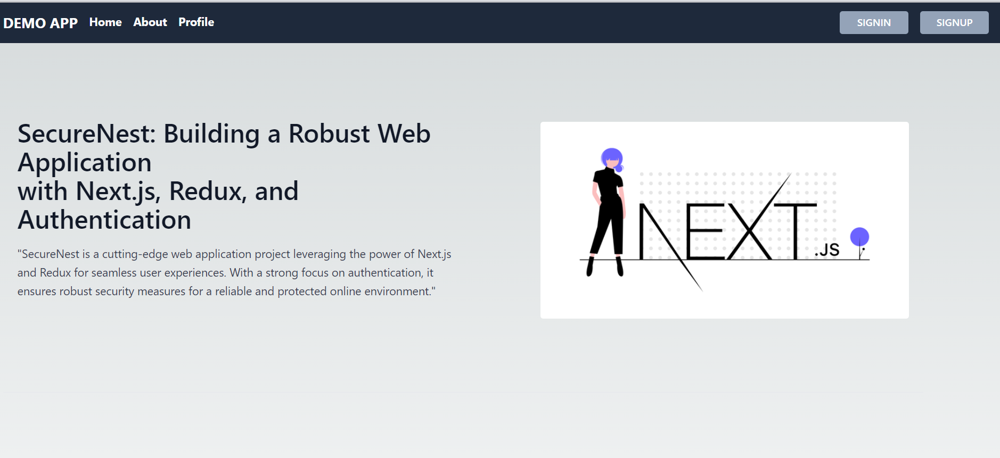
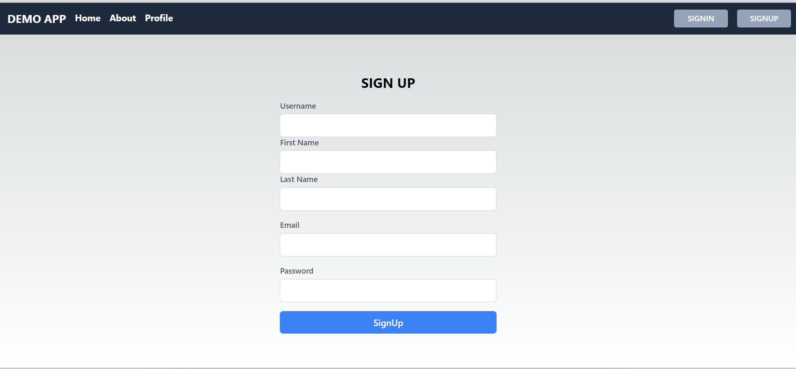
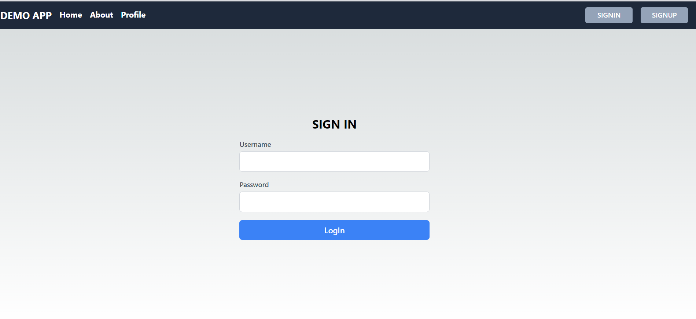
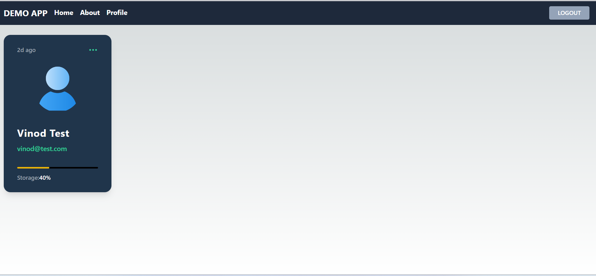
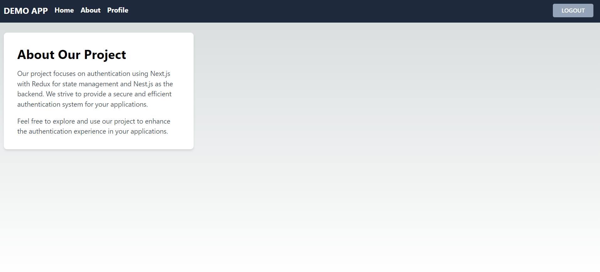

#  ⚡️ Fullstack Typescript Nest JS and Next JS ⚡️

## Features

1. Register
2. Login
3. Unit test using jest


## Backend
- Nest JS
- mongoose
- Express JS
- Swagger
- Helmet

```
cd backend/
create file .env copy from .env.example
npm install
npm run start:dev
```

## Frontend
- React JS
- Next JS


```
cd frontend/
npm install
npm run dev
```

# Screenshot app






